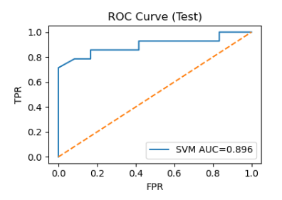
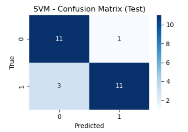

# 🧠 EEG-Based Clinical Decision Support Tool
### Product Feasibility & Business Analysis Study

> A full end-to-end BA feasibility study — evaluating whether machine learning applied to NREM sleep EEG neurophysiology could support early-stage schizophrenia risk classification within AI-assisted clinical decision support workflows.

[](https://www.linkedin.com/in/bhuminagar/)
[](https://sulky-peripheral-8e9.notion.site/Bhumi-Nagar-92e5984d31d8431c9515836eeaaf883e?source=copy_link)
[](https://lucid.app/lucidchart/b0addef3-e9e6-4ec2-8888-6506abee420c/edit?viewport_loc=-1312%2C-341%2C2204%2C1072%2C0_0&invitationId=inv_577db65d-d5d8-42d9-a730-7289cb368450)

---

## 📌 Project Overview

| Item | Details |
|---|---|
| **Project Type** | Healthcare AI Feasibility Study & Business Analysis |
| **Domain** | Psychiatric Clinical Decision Support / Healthcare AI |
| **Data Source** | Publicly available EEG-derived NREM sleep features (Kozhemiako et al., 2022, eLife) |
| **Dataset** | 130 subjects (72 Schizophrenia, 58 Control) · ~2,894 EEG-derived features |
| **Tools** | Python · scikit-learn · Pandas · NumPy · Lucidchart · MS Word |
| **Prepared By** | Bhumi Nagar — Business Analyst |

> *This project is a proof-of-concept feasibility study and does not represent a clinically deployable diagnostic system. All findings are exploratory and intended solely for educational and analytical purposes.*

---

## 📊 Model Performance Preview



> ROC curve comparison across all four evaluated models. SVM achieved the best performance with AUC 0.896 on the held-out test set, exceeding the predefined clinical feasibility threshold of AUC ≥ 0.80.



> Confusion matrix for the best-performing SVM model. Out of 26 test samples, the model correctly classified the majority of both schizophrenia and control cases, with a small number of false positives and false negatives documented and analyzed in the feasibility assessment.

---

## 🎯 Business Problem

Schizophrenia is a chronic psychiatric disorder that typically goes undiagnosed for years after early neurological changes begin. Current diagnostic pathways rely predominantly on subjective clinical assessment — behavioral observation, clinical interviews, and longitudinal monitoring — with no objective neurophysiological measurement at any stage.

**Specific gaps this project addresses:**

- No objective biomarker-based decision support exists in current psychiatric evaluation workflows
- Diagnosis depends entirely on clinician interpretation and patient self-report — introducing variability
- Long diagnostic timelines delay early intervention during the critical risk window
- No structured mechanism to flag at-risk patients before full symptom onset
- Significant diagnostic variability across clinical settings and practitioners

---

## 🏢 Stakeholder Analysis

| Stakeholder | Role | Business Need |
|---|---|---|
| Psychiatrists / Clinicians | Primary End Users | Objective decision-support, structured risk scoring |
| Patients | Indirect Beneficiaries | Earlier diagnosis, improved long-term outcomes |
| Hospital / Clinic Administration | Deployment Decision-Makers | Cost-effectiveness, compliance, operational fit |
| Healthcare IT Teams | Integration Owners | EHR compatibility, data security, infrastructure |
| Regulatory Bodies (FDA) | Compliance Authority | SaMD classification, patient safety standards |
| Data Scientists / ML Engineers | Technical Builders | Model performance, maintainability, scalability |

---

## 🎯 Business Objectives

**Primary Objectives:**

- Evaluate technical feasibility of ML-based schizophrenia classification using EEG-derived NREM sleep features
- Assess whether predictive analytics can meaningfully support clinical decision-making workflows
- Define business requirements, stakeholder workflows, and integration considerations
- Analyze operational, regulatory, and ethical deployment constraints
- Deliver a structured go/no-go feasibility recommendation based on study evidence

**Secondary Objectives:**

- Simulate a real-world end-to-end BA feasibility lifecycle for a healthcare AI product
- Demonstrate responsible AI evaluation methodology in a clinical context
- Establish a structured feasibility framework applicable to future healthcare AI initiatives

---

## 📦 BA Deliverables

| # | Deliverable | Description | Status |
|---|---|---|---|
| 1 | Project Charter | Scope, objectives, stakeholders, phases, risks, success criteria | ✅ Complete |
| 2 | Business Requirements Document (BRD) | 8 functional requirements, 8 NFRs, regulatory landscape, feasibility summary | ✅ Complete |
| 3 | As-Is vs To-Be Workflow | Clinical process transition — traditional to AI-assisted psychiatric evaluation | ✅ Complete |
| 4 | Feasibility Assessment | Five-dimension analysis — technical, clinical, operational, regulatory, ethical | ✅ Complete |
| 5 | AI Deployment Constraints | 20 deployment constraints identified across 5 categories (DC-01 to DC-20) | ✅ Complete |
| 6 | Responsible AI Considerations | 8 ethical risks assessed with mitigations (RA-01 to RA-08) | ✅ Complete |
| 7 | ML Validation Notebook | Full Python pipeline — preprocessing, feature selection, model training, evaluation | ✅ Complete |

---

## 🔄 Project Lifecycle

```text
Business Problem Identification
           ↓
Project Charter
           ↓
Business Requirements Gathering (BRD)
           ↓
EEG Dataset Acquisition & Exploratory Analysis
           ↓
Data Preprocessing & Feature Selection Pipeline
           ↓
ML Model Training & Comparative Evaluation
           ↓
Clinical Feasibility Assessment
           ↓
As-Is vs To-Be Workflow Modeling (Lucidchart)
           ↓
AI Deployment Constraints & Responsible AI Assessment
           ↓
Go/No-Go Feasibility Recommendation
```

---

## 🏗️ ML Pipeline Architecture

```text
Raw EEG-Derived Dataset (130 subjects · ~2,894 features)
        ↓
Data Cleaning Layer
(duplicate removal · missing value handling · outlier winsorization · rare category encoding)
        ↓
Stratified Train-Test Split (80/20 · 104 train / 26 test)
        ↓
Feature Processing Pipeline
(StandardScaler · OneHotEncoding · SelectKBest ANOVA F-test · K=100)
        ↓
Model Training & Comparison
(Logistic Regression · Decision Tree · Random Forest · SVM)
        ↓
Evaluation & Interpretation
(ROC-AUC · Confusion Matrix · F1-Score · 5-Fold Stratified Cross-Validation)
        ↓
Clinical Feasibility Assessment & Go/No-Go Recommendation
```

---

## 📊 Final Results

| Metric | Result |
|---|---|
| **Best Model** | Support Vector Machine (SVM) |
| **Test Accuracy** | ~84.6% |
| **ROC-AUC** | 0.896 |
| **CV AUC (SVM)** | 0.835 ± 0.105 |
| **CV AUC (Random Forest)** | 0.845 ± 0.091 |
| **Validation Method** | 5-Fold Stratified Cross-Validation |
| **Overall Recommendation** | Conditional Go |

---

## 🧭 Feasibility Decision Summary

| Dimension | Assessment |
|---|---|
| Technical Feasibility | Conditional Go |
| Clinical Feasibility | Requires Prospective Validation |
| Regulatory Feasibility | Not Deployment Ready |
| Operational Feasibility | Workflow Integration Feasible |
| Ethical Feasibility | Governance Controls Required |

---

## 🔍 Key Findings

| # | Finding | Insight |
|---|---|---|
| 01 | **Technical Feasibility** | SVM achieved AUC 0.896 — exceeding the predefined threshold of 0.80, confirming meaningful classification signal |
| 02 | **Biomarker Signal** | Fast spindle density (DENS_15) across frontal and central channels showed strongest predictive contribution — consistent with published neuroscience literature |
| 03 | **Clinical Feasibility** | Conditional — biomarkers validated in literature; prospective clinical validation study required before integration |
| 04 | **Regulatory Feasibility** | Not ready — FDA SaMD pathway identified (likely Class II); 510(k) or De Novo submission required |
| 05 | **Responsible AI** | Several responsible AI principles confirmed implemented; 6 remain as mandatory pre-deployment requirements |
| 06 | **Overall Recommendation** | Conditional Go — Go on continued R&D; No-Go on clinical deployment in current form |

---

## 💡 Key Insights

- Technical model performance alone is insufficient for healthcare AI deployment readiness
- A model achieving AUC 0.896 can still be classified as not deployment-ready — sample size, external validation, regulatory alignment, and bias auditing are non-negotiable
- Clinical workflow integration and governance are critical feasibility factors beyond model accuracy
- Responsible AI in psychiatric contexts is a foundational requirement, not a compliance checkbox
- The gap between feasibility and deployment is where BA work lives — requirements, constraints, governance, and workflow integration bridge that gap

---

## ⚠️ Limitations

- Limited sample size (130 subjects) — insufficient for clinical-grade validation
- No external validation dataset — single research cohort only
- Pre-extracted EEG features used — raw EEG signal processing not implemented
- No prospective clinical validation study conducted
- High-dimensional feature space (~2,894 features) relative to sample size introduces overfitting risk
- Results are exploratory and not clinically deployable in current form

---

## 🛠️ Tech Stack


---

## 📁 Repository Structure

```text
EEG-Clinical-Decision-Support-Feasibility-Analysis/
│
├── README.md
│
├── business-analysis/
│   ├── Project_Charter.pdf
│   ├── Business_Requirements_Document.pdf
│   ├── As_Is_To_Be_Workflow.pdf
│   ├── Feasibility_Assessment.pdf
│   ├── AI_Deployment_Constraints.pdf
│   └── Responsible_AI_Considerations.pdf
│
├── technical-validation/
│   └── EEG_ML_Clinical_Study.ipynb
│
├── visuals/
│   ├── roc_curve.png
│   └── confusion_matrix.png
│
└── data/
    ├── NREM_Schizophrenia.csv
    └── NREM.txt
```

---

## 📂 Data Source

| Item | Details |
|---|---|
| **Dataset** | EEG-derived NREM sleep features — anonymized individual-level data |
| **Source** | Kozhemiako et al. (2022) — *Non-rapid eye movement sleep and wake neurophysiology in schizophrenia* · eLife |
| **DOI** | [https://doi.org/10.1101/2021.12.13.472475](https://doi.org/10.1101/2021.12.13.472475) |
| **Subjects** | 130 (72 Schizophrenia · 58 Control) |
| **Features** | ~2,894 EEG-derived neurophysiological metrics |
| **Availability** | Publicly available research dataset |

> Raw data files are included in the `data/` folder of this repository.

---

## 🚀 Future Enhancements

- Deep learning models for raw EEG signal processing (CNN / Transformer architectures)
- Multimodal fusion — EEG + MRI + cognitive assessments
- SHAP-based model explainability for clinical trustworthiness
- Longitudinal prediction — prodromal → first episode → chronic stages
- External validation on independent clinical cohorts
- Bias and fairness audit across demographic subgroups
- Prospective clinical validation study design

---

## 🔗 Connect

[](https://www.linkedin.com/in/bhuminagar/)
[](https://sulky-peripheral-8e9.notion.site/Bhumi-Nagar-92e5984d31d8431c9515836eeaaf883e?source=copy_link)
[](https://lucid.app/lucidchart/b0addef3-e9e6-4ec2-8888-6506abee420c/edit?viewport_loc=-1312%2C-341%2C2204%2C1072%2C0_0&invitationId=inv_577db65d-d5d8-42d9-a730-7289cb368450)

---

*Prepared by Bhumi Nagar · Business Analyst · MBA, Business Analytics (STEM) · Saint Peter's University · January 2026*
